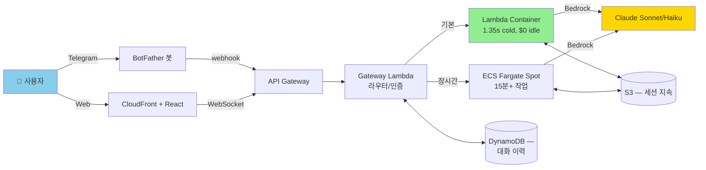
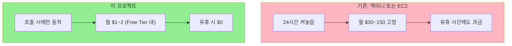
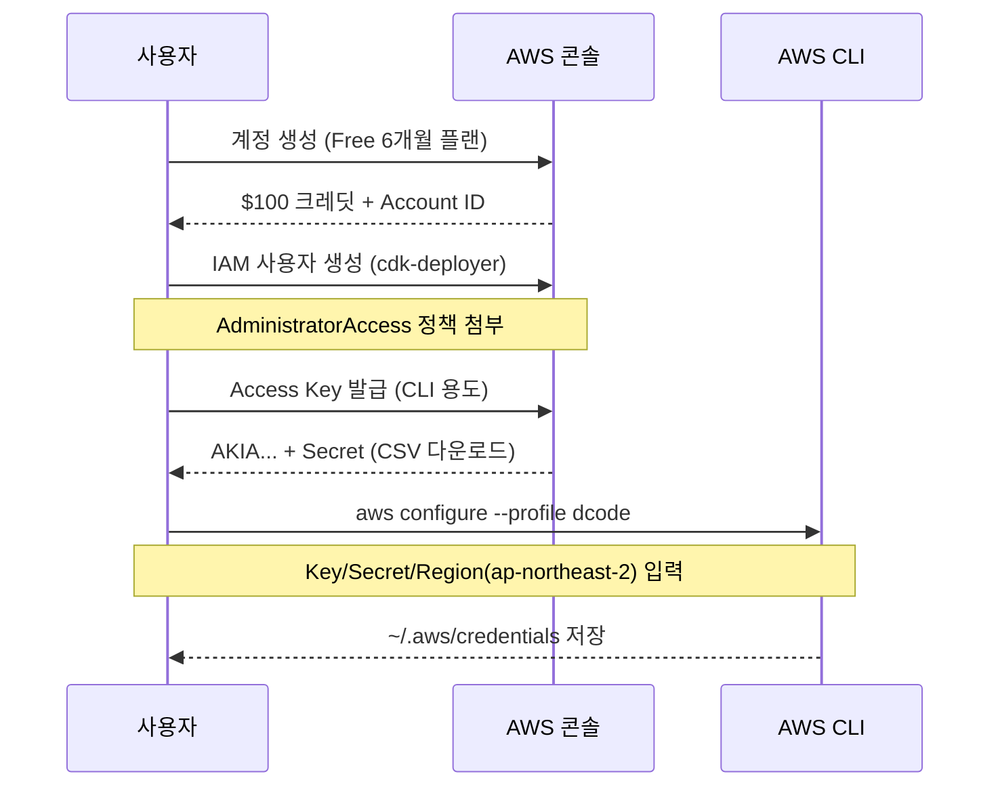
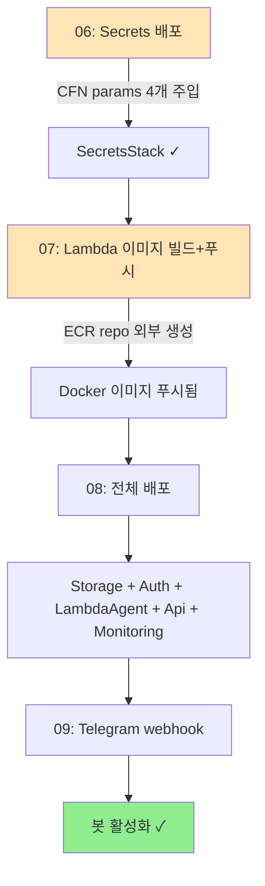
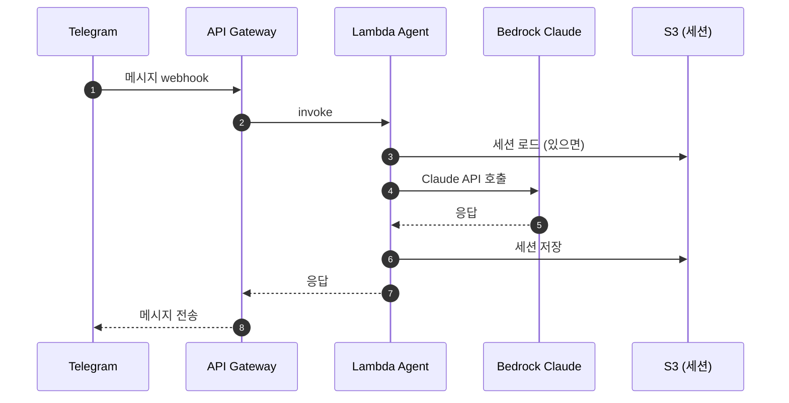
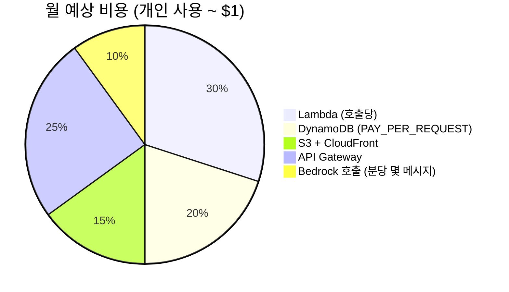

# AWS Serverless Cloud Agent — 한국어 빠른시작 가이드

> 맥미니 없이 **사용한 만큼만 과금되는** AI Cloud Agent를 AWS 서버리스로 띄우는 풀 튜토리얼.
> 원본: [serithemage/serverless-openclaw](https://github.com/serithemage/serverless-openclaw) (AWSKRUG 이상현님 발표)
> 이 레포: 한국어 안내 + **실배포로 검증된** 함정 회피 + 자동화 스크립트.

[](LICENSE)
[](https://aws.amazon.com/serverless/)
[](https://aws.amazon.com/cdk/)
[](#-검증-완료)

## ✅ 검증 완료

**2026-05-21 ~ 22 실제 AWS 계정에서 처음부터 끝까지 따라하며 검증.** Telegram 봇이 실제 Claude Haiku 4.5 응답을 받아왔습니다.

| 항목 | 결과 |
|---|---|
| 6 CloudFormation stacks | 전부 CREATE_COMPLETE |
| Lambda Container | arm64, 2GB, 콜드 ~600ms, 웜 ~10ms |
| Bedrock 호출 | Claude Haiku 4.5 (`global.` inference profile) |
| Telegram webhook | 메시지 → API GW → Lambda → Bedrock → 응답 |
| 발견한 함정 | **14가지** (docs/troubleshooting.md) |
| 최종 비용 | 검증 전체 진행 + 며칠 운영 ~$0.30 |

## 0. 이게 뭐예요?

OpenClaw 같은 LLM agent를 **상시 켜놓는 맥미니 없이** AWS 서버리스로 굴립니다.
유휴 시간엔 **$0**, 호출당 약 1.35초 콜드스타트, **월 ~$1**로 운영.



## 1. 왜 서버리스?



| | 기존 (맥미니/EC2) | 이 프로젝트 |
|---|---|---|
| 고정비 | $30~150/월 | **$0** |
| 유휴 비용 | 매시간 과금 | **$0** |
| 응답성 | 즉시 | 콜드 1.35s / 웜 0.12s |
| 확장 | 수동 | 자동 |
| 6개월 무료 크레딧 | 안 됨 | **$200 크레딧** |

## 2. 전체 흐름 (한 눈에)

```mermaid
flowchart LR
    A[0. 준비물<br/>Node/Docker/AWS계정] --> B[1. AWS 자격증명]
    B --> C[2. Budget 알람<br/>$5/월]
    C --> D[3. Bedrock 검증]
    D --> E[4. CDK bootstrap]
    E --> F[5. Telegram bot]
    F --> G[6. Secrets 배포]
    G --> H[7. Lambda 이미지<br/>빌드+푸시]
    H --> I[8. 전체 배포]
    I --> J[9. Telegram webhook<br/>활성화]
    J --> K[✅ 봇과 대화]

    style C fill:#FFE4B5
    style I fill:#90EE90
    style K fill:#FFD700
```



각 단계는 `scripts/0X-*.sh` 1개에 1:1 대응. 순서대로 실행하면 됩니다.

## 3. 빠른 시작

### 사전 요구사항

```bash
# 자동 점검
./scripts/00-prereqs.sh
```

수동 설치 (macOS):
```bash
brew install node@22 awscli git
brew install --cask docker
npm install -g aws-cdk
```

### Step 1: 원본 클론

```bash
# 이 레포 옆에 원본도 같이 클론 (스크립트가 ../serverless-openclaw 를 참조)
cd ~/your-workspace/
git clone https://github.com/AI-Dico/aws-serverless-agent-ko.git
git clone https://github.com/serithemage/serverless-openclaw.git
cd aws-serverless-agent-ko
```

### Step 2: AWS 계정 + 자격증명



```bash
./scripts/01-aws-configure.sh
```

### Step 3: 비용 폭탄 방지 (필수!)

```bash
BUDGET_EMAIL=your@email.com ./scripts/02-budget-alarm.sh
```
$5/월 알람 자동 생성 (50% / 100% 실제 / 100% 예측).

### Step 4: Bedrock 검증

```bash
./scripts/03-bedrock-check.sh
```

서울에서 사용 가능한 Claude 모델 + Haiku 4.5 호출 테스트.

**함정**: Sonnet 4.5/Haiku 4.5 는 on-demand 미지원 → **inference profile** 필요:
- ❌ `anthropic.claude-haiku-4-5-20251001-v1:0`
- ✅ `global.anthropic.claude-haiku-4-5-20251001-v1:0` (`global.` prefix)

### Step 5: CDK bootstrap

```bash
./scripts/04-bootstrap-cdk.sh
```

해당 리전에 staging S3 + ECR + IAM roles 생성 (1회).

### Step 6: Telegram bot

```bash
./scripts/05-telegram-bot.sh
```

@BotFather 안내 + 토큰 검증 + Keychain 백업.

### Step 7: `.env` 작성

```bash
cd ../serverless-openclaw  # 원본 레포로
cp ../aws-serverless-agent-ko/.env.example .env
# 편집기로 .env 열어서 TELEGRAM_BOT_TOKEN 채우기
```

### Step 8: 배포 (3단계)



```bash
cd ~/your-workspace/aws-serverless-agent-ko
./scripts/06-deploy-secrets.sh       # ~2분
./scripts/07-build-lambda-image.sh   # 10~15분
./scripts/08-deploy-all.sh           # 10~15분
./scripts/09-telegram-webhook.sh     # 즉시
```

### Step 9: 동작 확인

Telegram 앱에서 만든 봇과 대화 → 응답 옴 (콜드스타트 시 1~2초).



## 4. 예외 케이스 / 함정 (실배포로 검증한 14가지)

### 4.1 에러 메시지 → 어디로 가야 하나

| 본 에러 | 원인 | 해결 |
|---|---|---|
| 콘솔에서 "KMS 키 만드시오" 안내 | IAM ≠ KMS 헷갈림 | IAM → Users → Security credentials → Access keys ([T1](docs/troubleshooting.md#t1-kms--iam-access-key)) |
| `Model access page is deprecated` | 2025+ 부터 자동 활성화 | 그냥 모델 호출 → 자동 활성화 ([T2](docs/troubleshooting.md#t2-bedrock-model-access-페이지가-deprecated)) |
| `on-demand throughput isn't supported` | 신규 모델은 inference profile 필수 | 모델 ID 에 `global.` prefix ([T3](docs/troubleshooting.md#t3-on-demand-throughput-isnt-supported)) |
| `Parameters missing a value: BridgeAuthToken, ...` | SecretsStack 파라미터 미주입 | `./scripts/06-deploy-secrets.sh` 먼저 ([T4](docs/troubleshooting.md#t4-cdk-deploy-parameters-missing-a-value)) |
| `Source image ... does not exist` | ECR repo 외부 생성 필요 | `./scripts/07-build-lambda-image.sh` ([T5](docs/troubleshooting.md#t5-lambda-source-image-does-not-exist)) |
| `AccessDeniedException` (모델 호출) | Anthropic 약관 폼 미제출 | 콘솔 use case form 제출 ([T6](docs/troubleshooting.md#t6-bedrock-모델은-있는데-호출-실패-anthropic-약관)) / ([T14](docs/troubleshooting.md#t14-bedrock-model-use-case-details-have-not-been-submitted-🔴-가장-마지막-함정)) |
| `Cannot connect to Docker daemon` | Docker Desktop 미실행 | Docker Desktop 시작 또는 `colima start` ([T7](docs/troubleshooting.md#t7-docker-데몬-미실행)) |
| 청구서에 NAT Gateway/EC2 비용 | 실수로 만든 자원 | `./scripts/99-teardown.sh` ([T8](docs/troubleshooting.md#t8-비용이-늘고-있는데)) |
| 봇 무응답 | Webhook 미등록 | `./scripts/09-telegram-webhook.sh` ([T9](docs/troubleshooting.md#t9-telegram-봇이-응답-안-함)) |
| `image manifest ... is not supported` | Docker Desktop 28+ OCI manifest | `regctl image mod --to-docker` ([T11](docs/troubleshooting.md#t11-lambda-image-manifest--is-not-supported-🔴-큰-함정)) |
| `Cannot find module '@smithy/smithy-client'` | Dockerfile 의존성 누락 | Dockerfile 패치 ([T12](docs/troubleshooting.md#t12-lambda-container-cannot-find-module-smithysmithy-client)) |
| `Package subpath './retry' not exported` | OpenClaw + lib-dynamodb @smithy 버전 충돌 | 둘을 같이 `npm install` ([T13](docs/troubleshooting.md#t13-lambda-container-smithycoreretry-not-exported)) |
| `Model use case details have not been submitted` | 🔴 **가장 흔히 만나는 마지막 함정** | 콘솔 use case form 5분 ([T14](docs/troubleshooting.md#t14-bedrock-model-use-case-details-have-not-been-submitted-🔴-가장-마지막-함정)) |

### 4.2 단계별 진단 흐름

```mermaid
flowchart TD
    Start[배포 진행 중<br/>에러 발생] --> Q1{어느 단계?}

    Q1 -->|콘솔 IAM 설정| F1[T1: KMS 아님, Access Key]
    Q1 -->|cdk bootstrap| F2[T2/T3: 콘솔 region<br/>+ inference profile prefix]
    Q1 -->|cdk deploy| Q2{어떤 에러?}
    Q1 -->|Lambda 실행| Q3{어떤 import?}
    Q1 -->|Telegram 봇| Q4{응답 내용?}

    Q2 -->|Parameters missing| F4[T4: scripts/06 먼저]
    Q2 -->|Source image| F5[T5: scripts/07 먼저]
    Q2 -->|manifest not supported| F11[T11: regctl 변환]

    Q3 -->|@smithy/smithy-client| F12[T12: Dockerfile 의존성]
    Q3 -->|@smithy/core/retry| F13[T13: lib-dynamodb 같이 install]

    Q4 -->|무응답| F9[T9: webhook 등록]
    Q4 -->|use case not submitted| F14[T14: Anthropic 폼]
    Q4 -->|정상 응답| OK[✅ 끝]

    style F1 fill:#FFB6C1
    style F11 fill:#FFB6C1
    style F14 fill:#FFB6C1
    style OK fill:#90EE90
```

### 4.3 사용자가 직접 해야 하는 2가지 (스크립트 자동화 불가)

스크립트로 자동화한 12개와 별개로 **콘솔에서 직접** 해야 하는 작업 2가지:

1. **[T1] IAM Access Key 발급** — `aws configure` 입력값. AWS 콘솔에서 IAM 사용자 + Access Key (CSV 다운로드 1회만 가능)
2. **[T14] Anthropic Use case form** — Bedrock 콘솔에서 한 번만. 5분, 즉시 활성화

스크립트가 `./scripts/01-aws-configure.sh` / `./scripts/03-bedrock-check.sh` 실행 시점에 자동 안내합니다.

### 4.4 절대 만들면 안 되는 자원 (비용 폭탄)

| 자원 | 시간당 비용 | 한 달 |
|---|---|---|
| NAT Gateway | $0.045 | **$32** |
| Application Load Balancer | $0.022 + LCU | **$16+** |
| EC2 t3.small | $0.021 | **$15** |
| RDS db.t3.micro | $0.018 | **$13** |
| Interface VPC Endpoint | $0.01 | **$7** |

이 프로젝트는 **위 자원을 절대 만들지 않습니다** (CDK 가 `natGateways: 0` 강제). `cdk diff` 로 확인 후 배포하세요.

자세한 설명: [`docs/troubleshooting.md`](./docs/troubleshooting.md) (T1~T14 전체)

## 5. 비용 구조



- **유휴 시 0원** (Lambda + DynamoDB on-demand + S3)
- **호출당 ms 단위 과금**
- **Free Tier** 안에선 거의 무료 (Lambda 1M 호출/월, DynamoDB 25GB, S3 5GB)
- **AWS Free 6개월 플랜의 $200 크레딧** = 약 200개월 사용 가능

상세: [`docs/cost.md`](./docs/cost.md)

## 6. 정리 (사용 끝났을 때)

```bash
./scripts/99-teardown.sh
```

모든 stack + ECR repo 삭제. Budget 알람은 콘솔에서 따로.

## 7. 더 깊이 들어가기

- [`docs/architecture.md`](./docs/architecture.md) — 듀얼 컴퓨트 (Lambda + Fargate) 설계
- [`docs/troubleshooting.md`](./docs/troubleshooting.md) — 모든 함정 + 해결법
- [`docs/cost.md`](./docs/cost.md) — 비용 분석 + Free Tier 활용
- [`skills/aws-serverless-agent/`](./skills/aws-serverless-agent/) — Claude Code skill (다음 번엔 자동화)

## 라이센스

MIT — 원본 [serverless-openclaw](https://github.com/serithemage/serverless-openclaw) 의 라이센스 따름.

## 크레딧

- 발표: 이상현 (AWSKRUG, AWS Serverless Hero) — [serithemage/serverless-openclaw](https://github.com/serithemage/serverless-openclaw)
- 한국어 가이드: [AI-Dico](https://github.com/AI-Dico)
