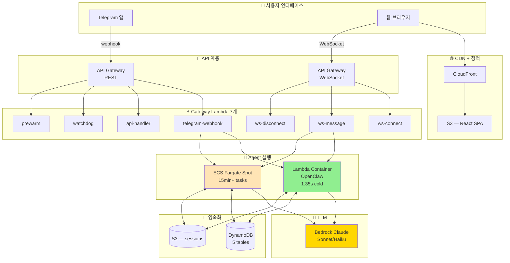
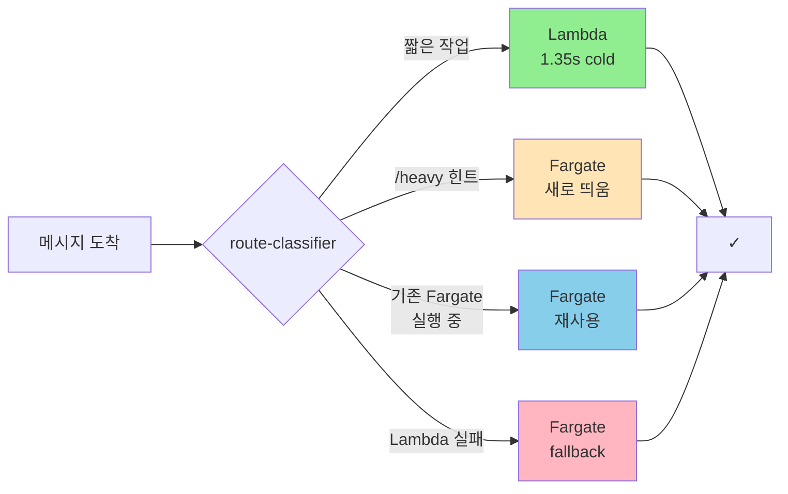
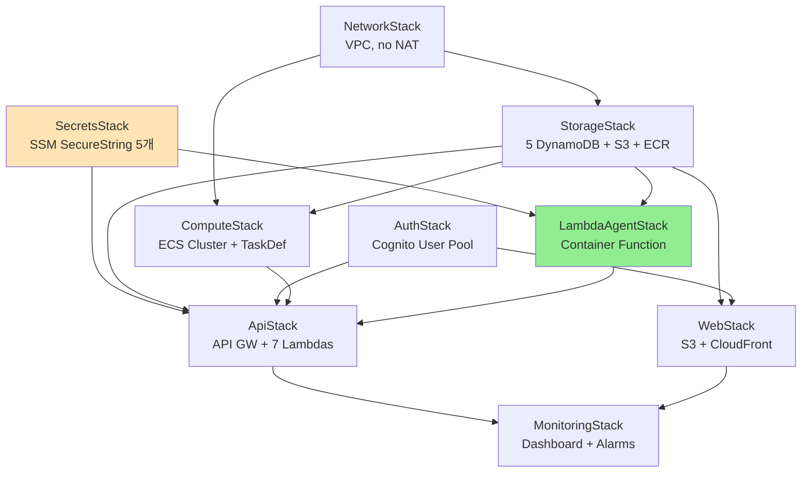
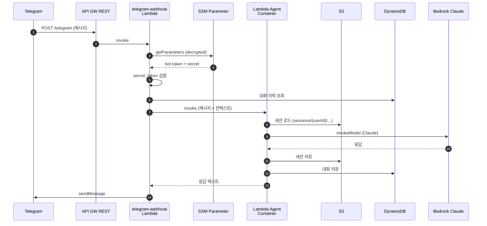
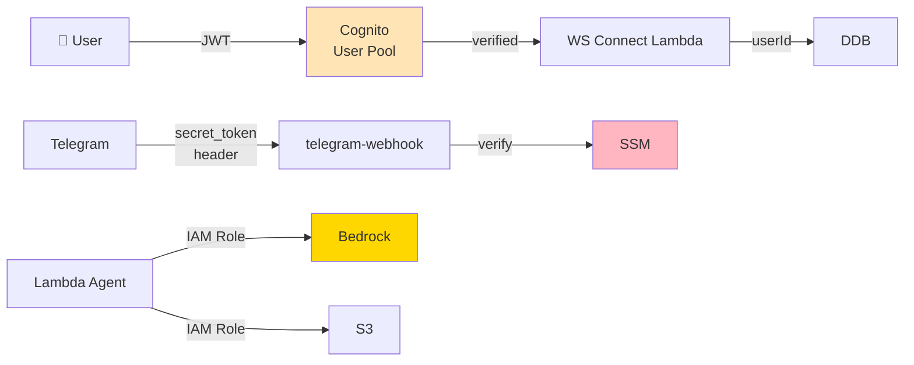

# 아키텍처

## 전체 구조

## 듀얼 컴퓨트의 비밀

코드: `packages/gateway/src/services/route-classifier.ts`

| 모드 | 콜드 | 비용 | 한계 |
|---|---|---|---|
| Lambda (기본) | 1.35s | $0/유휴 | **15분 timeout** |
| Fargate Spot | ~68s | $0/유휴 | 무제한 |
| 스마트 라우팅 | 둘 다 | 동일 | 자동 선택 |

## CDK Stacks 의존성

**배포 순서**:
1. SecretsStack (parameter 4개 주입 — 첫 1회만)
2. ECR repo `serverless-openclaw-lambda-agent` 생성 + 이미지 푸시
3. 나머지 `cdk deploy --all`

## 데이터 흐름 — Telegram 메시지

## DynamoDB 스키마

| Table | PK | SK | TTL | 용도 |
|---|---|---|---|---|
| Conversations | `USER#{userId}` | `CONV#{id}#MSG#{ts}` | ✓ | 메시지 이력 |
| Settings | `USER#{userId}` | `SETTING#{key}` | — | 사용자 설정 |
| TaskState | `USER#{userId}` | — | ✓ | Fargate task 상태 |
| Connections | `CONN#{connId}` | — | ✓ | WebSocket 연결 |
| PendingMessages | `USER#{userId}` | `MSG#{ts}#{uuid}` | ✓ | 콜드스타트 큐 |

전부 **PAY_PER_REQUEST** — 사용한 만큼만 과금.

## 보안 모델

**원칙**:
- API key 절대 디스크 미저장 (SSM SecureString → 런타임 env)
- Server-side userId만 (IDOR 방지)
- Bridge Bearer token (모든 endpoint 인증)
- Cognito JWT (`aws-jwt-verify` 로 ws-connect 에서 검증)

## 추가 자료

- 원본 발표: [serithemage/serverless-openclaw](https://github.com/serithemage/serverless-openclaw)
- 상세 설계: 원본 `docs/architecture.md`, `docs/lambda-migration-journey.md`
