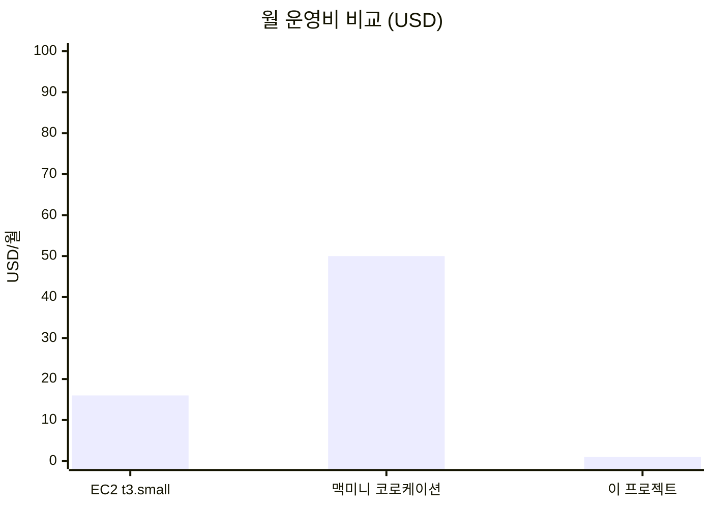

# 비용 분석

## 결론



**이 프로젝트는 개인 사용 시 월 $1~2, 6개월 무료 크레딧 $200 으로 약 8년치 무료 운영.**

## 항목별 비용

### Free Tier 안에서 무료

| 서비스 | Free Tier 한도 | 우리 사용량 |
|---|---|---|
| Lambda | 1M 호출/월 + 400K GB-초 | 메시지당 1초 × 1000 = 1K GB-초 (0.25%) |
| DynamoDB | 25GB + 25 WCU/RCU on-demand | 대화 이력 수십 MB (0.1%) |
| S3 | 5GB + 20K GET | 세션 파일 수십 KB |
| CloudWatch Logs | 5GB ingestion | Lambda 로그 ~수십 MB |
| API Gateway | 1M REST + 1M WebSocket | 메시지당 2회 = 2K (0.2%) |

### Free Tier 초과 시 (드물게)

| 서비스 | 가격 | 메시지 1회당 |
|---|---|---|
| Lambda invocation | $0.20/M | $0.0000002 |
| Lambda compute (arm64, 2GB) | $0.0000133/GB-초 | 1초 = $0.0000266 |
| Bedrock Haiku 4.5 input | $0.80/M tokens | ~500 tokens = $0.0004 |
| Bedrock Haiku 4.5 output | $4/M tokens | ~500 tokens = $0.002 |
| Bedrock Sonnet 4.5 input | $3/M tokens | ~500 tokens = $0.0015 |
| Bedrock Sonnet 4.5 output | $15/M tokens | ~500 tokens = $0.0075 |

**메시지 1회당 비용 (Haiku)**: ~$0.003 (약 4원)
**메시지 1회당 비용 (Sonnet)**: ~$0.01 (약 13원)

### 고정 비용 (있지만 무시 가능)

- ECR storage: $0.10/GB/월 → 이미지 ~500MB = **$0.05/월**
- CloudWatch Logs storage: $0.03/GB/월 → 수십 MB = **$0.001/월**
- DynamoDB 백업: 안 함 (선택)

### 절대 만들면 안 되는 것

| 자원 | 월 비용 | 이 프로젝트에서? |
|---|---|---|
| NAT Gateway | $32 + 데이터당 | ❌ 안 씀 (`natGateways: 0`) |
| Application Load Balancer | $16 + LCU | ❌ 안 씀 (API Gateway 사용) |
| EC2 t3.small | $15 | ❌ 안 씀 |
| RDS db.t3.micro | $13 | ❌ 안 씀 |
| ElastiCache | $12 | ❌ 안 씀 |
| Interface VPC Endpoint | $7 + 데이터당 | ❌ 안 씀 (Gateway Endpoint 만) |

## 시나리오별 시뮬레이션

### 시나리오 1: 가벼운 개인 사용 (메시지 100회/월, Haiku)

- Lambda: Free Tier 내
- DynamoDB: Free Tier 내
- Bedrock: 100 × $0.003 = **$0.30**
- 기타: ~$0.05
- **합계: 약 $0.35/월**

### 시나리오 2: 매일 사용 (메시지 1000회/월, Haiku)

- Lambda: Free Tier 내
- DynamoDB: Free Tier 내
- Bedrock: 1000 × $0.003 = **$3**
- 기타: ~$0.10
- **합계: 약 $3.10/월**

### 시나리오 3: Sonnet 으로 1000회 (긴 컨텍스트)

- Bedrock: 1000 × $0.01 = **$10**
- 기타: ~$0.10
- **합계: 약 $10.10/월**

→ **Haiku 가 3배 저렴**. 검증/POC 는 Haiku, 정밀도 필요할 때만 Sonnet.

## 비용 통제 방법

### 1. Budget 알람 (필수)

```bash
BUDGET_EMAIL=you@example.com BUDGET_LIMIT=5 ./scripts/02-budget-alarm.sh
```

50% / 100% 실제 / 100% 예측 시 이메일.

### 2. CloudWatch Logs retention 단축

CDK 가 이미 `ONE_WEEK` 로 설정. 더 줄이려면 `lambda-agent-stack.ts`:
```typescript
retention: logs.RetentionDays.THREE_DAYS
```

### 3. 모델 다운그레이드

`.env`:
```bash
# 운영 사용은 Haiku 권장
AI_MODEL=global.anthropic.claude-haiku-4-5-20251001-v1:0
```

### 4. 안 쓸 때 teardown

```bash
./scripts/99-teardown.sh
```

크레딧 보존. 다시 쓸 땐 처음부터 (~30분).

### 5. Free 6개월 vs Paid

| 플랜 | 한도 초과 시 |
|---|---|
| **Free 6개월** | 자동 중단 (요금 폭탄 방지) |
| **Paid** | pay-as-you-go 계속 청구 |

**개인 학습/POC 는 Free 추천**. 6개월 후 Paid 로 전환하거나 계정 닫기.

## 실측 (2026-05-21 ~ 22 검증)

이 가이드 따라 처음부터 끝까지 진행했을 때 발생한 실제 비용:

### 일회성 (~$0.10)
- CDK bootstrap: ~$0.01 (1회)
- ECR push (Lambda + bootstrap): ~$0.05 (이미지 ~300MB)
- 빌드 재시도 (T11/T12/T13 만나서 약 7회 push): ~$0.10
- Bedrock 테스트 호출 약 20회 (Haiku): ~$0.01

### 운영 (~$0.05/월)
- ECR storage 유지: $0.10/GB/월 × 0.3GB = **$0.03/월**
- CloudWatch Logs 보관: ~$0.001/월
- DynamoDB on-demand: $0 (요청 없으면)
- Lambda + API GW: $0 유휴 시

### Telegram 봇 사용 시 (Haiku 4.5)
- 메시지 1회: ~$0.003 (입력 500토큰 + 출력 500토큰 가정)
- 하루 50회: ~$0.15
- 한 달 1500회: **~$4.50**

### 검증 누적 (실제 발생)
- 처음부터 끝까지 풀 진행 + 며칠 운영: **약 $0.30**
- AWS Free 6개월 $100 크레딧 내 → **무료**
